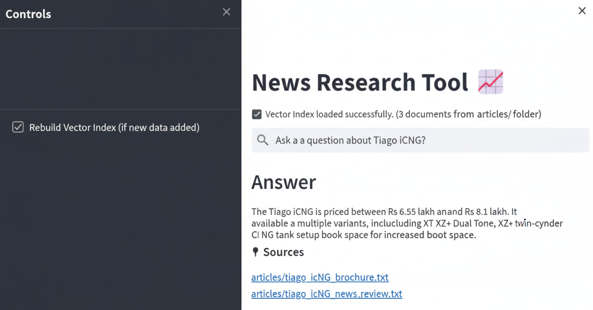

 # 📖 AI-Powered Article Summarizer & Q&A Tool  

## 📌 Project Overview  
This project is an **AI-based summarization and Q&A system** designed to make complex articles easier to understand and interact with.  

The idea originated from real-world use: my brother, a law firm researcher, often publishes articles on **technology policies**. Readers frequently had to use tools like ChatGPT or Google to understand or ask follow-up questions about his articles.  

To address this, I built a solution that automatically **summarizes long articles** and enables users to **ask questions directly on the website**—making the reading experience seamless, interactive, and more accessible.  

Beyond law and tech-policy, this system can also be applied to **research, data analysis, or equity research**, where users need to extract insights and answers from large volumes of text efficiently.  

)

---

## 🚀 Key Features  
- 📝 **Automated Summarization** – Generates concise summaries of long and complex articles.  
- 💬 **Interactive Q&A** – Users can ask natural language questions and receive precise answers from the article content.  
- ⚡ **Scalable & Context-Aware** – Handles long articles by splitting them into semantically rich chunks.  
- 🔍 **Fast Retrieval** – Uses embeddings and vector search to fetch the most relevant context.  
- 🔧 **Extensible** – Can be adapted for other domains like academic research or financial reports.  

---

## 🛠️ Technical Architecture  
1. **Article Storage** – New articles are saved in a backend database with metadata (title, author, timestamp).  
2. **Chunking** – Articles are split into overlapping chunks using a text splitter, ensuring context is preserved.  
3. **Vector Embeddings** – Each chunk is embedded with an LLM-based embedding model and stored in a **vector database** with metadata.  
4. **Query Processing** – User questions are embedded and matched against stored chunks via similarity search.  
5. **Answer Generation** – Retrieved chunks are merged into context and passed to the LLM, which produces a coherent answer or summary.  
6. **Orchestration** – **LangChain** manages the pipeline for chunking, embedding, retrieval, and response generation.  

---

## 🧰 Tech Stack  
- **LangChain** – Workflow orchestration (chunking, embedding, retrieval)  
- **Vector Database** (e.g., Pinecone / FAISS / Weaviate) – Fast semantic search  
- **Backend Database** – Stores raw articles and metadata  
- **Large Language Model (LLM)** – Powers embeddings, summarization, and Q&A generation  

---

## 🎯 Impact  
This project demonstrates how **LLMs + vector databases** can be combined to build practical, real-world applications that simplify complex reading and enhance research workflows.  

It not only improves accessibility for readers but also highlights my skills in:  
- 📐 Designing scalable architectures  
- 🤖 Applying modern AI techniques (LLMs, embeddings, LangChain)  
- 🔗 Solving real-world problems with end-to-end solutions  

add this image in this projec t Python packages for the project.
- faiss_store_openai.pkl: A pickle file to store the FAISS index.
- .env: Configuration file for storing your OpenAI API key.
